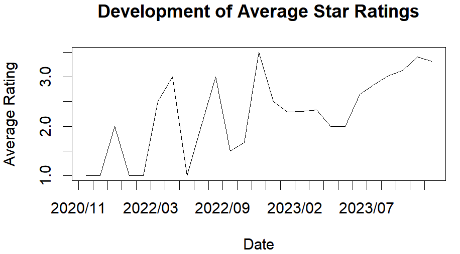
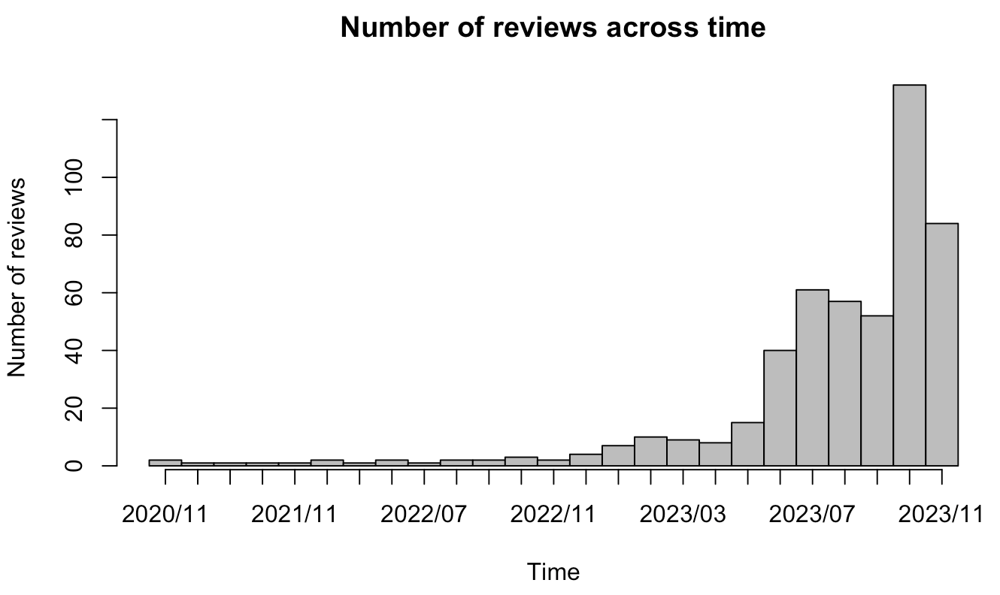
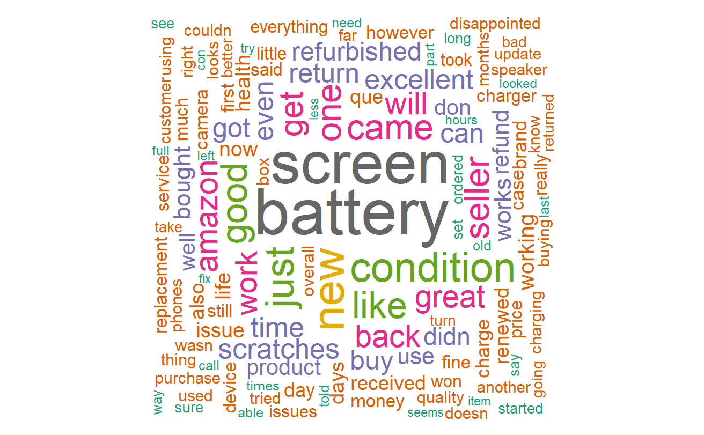
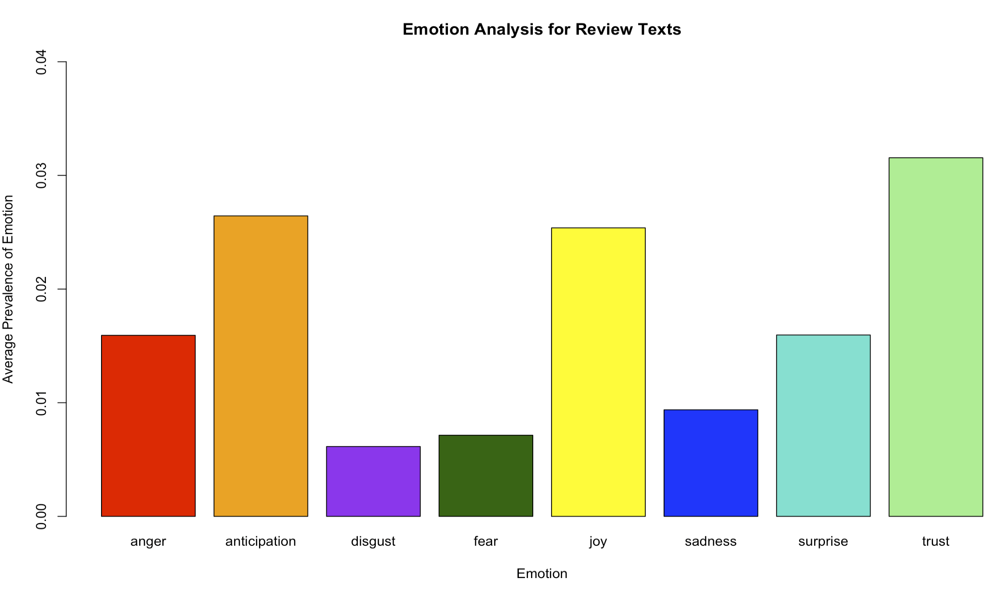

```{r setup, include=FALSE}
knitr::opts_chunk$set(echo = TRUE)
#setwd("/Users/carolinemeyer/Desktop/Sem V/1479 (Applications of Data Science) ")
```

\newpage

# Report

## Introduction / Abstract

In this Report, we take a deep dive into the world of customer reviews to uncover trends and insights related to a selected product on Amazon.com.
With a foundation of about 500 text-based evaluations, the product that we have carefully picked from a product category of our choosing offers big variety of thoughts and comments.

The R code of the entire process is available as an appendix, revealing the details of our analysis procedure.
Additionally, our presentation summarises the most significant discoveries, providing a quick overview of the brand's online presence and consumer attitude.
The gathered dataset, in .rda format provides the basis for our investigation and creates a clear picture of the brand's interaction with its clientele.

## Our Aims

Our goal is to analyse and extract useful data from the collection of customer reviews.
In doing this, we want to provide basic answers that explain the brand's effectiveness and consumer impression.

In order to get a good impression of customer´s opinions, we will analyse common and frequent terms that appear in the reviews of this data.
We will also explore temporal dimension, tracking indicators as they change over time to provide insights how the product or the opinions evolve over time.
We will be examining the tone of the text to determine the emotional undertones that are typical of customer feedback.
Finally, we will interpret the subjects that predominate in customer conversations, revealing the problems and elements that are most important to the clientele.

Our ultimate objective is to offer the brand with insights that can be put into practise as we go through these elements.
If the brand's goals are a high star rating and happy consumers, our study will help them in archieving that.

## Preparation

Before analysing the data, we actually have to get the data.
We did this by using a basic webscraper to extract important information on the prodct´s review page.

## Scraping the data

To scrape reviews which we can then analyze we start by installing necessary / helpful packages.
We could then start with tasks such as HTML parsing and mimicking a browser with a machine.

However, we quickly ran into problems as Amazon makes an effort to prevent scraping, particularly when many pages are being scraped.
We started by trying the code with different products and pages, experimenting with differend HTML nodes and xpaths.
All this was done with the R-package Rvest.
In the end, we created custom headers, a random time out to to miick human behaviour as well as to avoid being "too aggressive" and imitated request headers.
We managed to scrape 100 reviews without filtering for specific terms. More reviews where not attainable, since Amazon, as part of their web-scraping prevetion, limits the number of pages of reviews to be viewed to 10, and the number of reviews per page also to 10.
To increase the dataset size, we filtered for all five possible star ratings and obtained the 100 available reviews per star rating, resulting in a total of 500 (5x100) reviews. However, this comes with the big downside of introducing a bias.
We nevertheless decided to continue as one purpose of this project is to carry out a complete analysis and larger, although biased, dataset allows for intersting insights into the different wordings, sentiments and emotions associated with different star ratings.

We decided to extract information on the title of the reviews, the review content, the review date, whether the review is verified or not, how many people found it helpful, and the star rating.
Our dataset thus contains 500 observations with 6 variables.

The variables are the following: 

- `review_title`: This is the title of the review 
- `review_text``: This is the review itself.
- `formatted_date`: This is the date when the review was published.
- `verified`: This indicated whether a review is made by an officially verified buyer or not.
- `N_helpful`: This is the count of people that marked the review as being helpful.
- `star_rating_num`: This is the score of the review. The maximum is five and minimum is zero. A higher number corresponds to a more positive opinion about the product.

The technical details of the data analysis are provided in the appendix, accompanied by the corresponding R code.

## General Analysis

To get an idea of the data we are working with, We want to start by taking a look at some general features of our review data.
We will keep this section short as it only serves to get a basic understanding of the data.

Let us start by taking a look at **when the reviews were made**: The time frame of our reviews spans from 06th of June, 2020, when the first review was published until the 17th of November, 2023, where the most recent one was written.
This shows and ensures that we consider reviews in a long time span, considering potential product updates, relaunches and alike.

It is also interesting to get more of an insight into the **general rating behavior**.
The **worst rating** is 1 stars, the **highest one** is 5 stars and the **average rating** amounts to 3 stars.
This can be shown by using a histogram of the distribution of star ratings. Note that the equal distribution is due to the way our webscraper works.

Another visualization of the **distribution of star ratings** might be helpful to see how the product has performed in general.
Thus, we present a histogram:


We can also visalize the average star rating across time.
This gives us a good guess of how the quality of the product might deteriorate or improve.

 

It seems as the average rating improves in the long term, which is a good sign.
Let´s see if there is any correlation with **the number of reviews published across our time period**.

Also, the average rating seems to improve already after the first reviews and stays relatively constant throughout the time period where reviews were published.

It might also be interesting to take a look at **the number of reviews published across our time period** and see if and how this corresponds to the development of the star ratings.



We can see a bit of seasonality in this plot but mainly, there is an increasing tendency of the reviews.

When comparing the two plots we can see that overall the review-situation improved over time: Both more reviews and better reviews were published in the long run.
The dip in June might be interesting to analyze - especially to see if it remains so apparent when the dataset of reviews is larger and less restricted.

Furthermore, we might want to take a look at **helpfulness of the reviews**.
We can see that the reviews were rated as helpful by between 0 and 50 people, with an average of 3.47 and a median of 0 as well.
This indicates skewedness and strong outliers, so we want to take a closer look:


This supports our hypothesis that the vast majority of reviews are rated as non-helpful by very few to none people.
Only very few people attained over 15 "helpfulness"-votes.
We can see the "Winner takes it all" principle.
Overall a third of the reviews were perceived as helpful, meaning that at least 1 customer rated them as such.

## Text Analysis

This section focuses on text analysis, aiming to uncover patterns, relationships, and insights embedded in the textual feedback provided by customers.

To kick off our text analysis, we start by taking a look at review length.
We can see that the average length of a review in our dataset is about 70 words.
But what might be more interesting is the \*\*correlation between the length of a reviews and its rating.
The correlation is about -0.3 What this reveals is that long reviews tend to be more negative or that customers who have a negative opinion about a product tend to share more information to explain or complain.

\*\*correlation between the length of a review and its helpfulness The correlation is at about 0.63 This leads to the conclusion that longer reviews tend to be rated as more helpful as they for example share more information and details that can be useful for other potential customers.

Now let us dive even deeper into text analysis than merely the word count.
Let's have a look at **what people actually write in their reviews**.
To do this, we cleaned the reviews by removing special characters, nubers, punctuation, extra white spaces, common stopwords and reduced all words to their stem.
After unsurprisingly seeing words like Phone, iphone, apple as the most frequent, we removed these and contructed the following wordcloud:

 

This reveals a much more interesting picture.
We chose that all terms that are mentioned at least 5 times in the 100 reviews are shown in the word cloud.
The by far biggest and thus most frequently used significant term in reviews is "battery".
Additionally screen and scratches as well as condition might be interesting ones to dive into.

Let us now do the same for the titles of the reviews and see if there are differences:


Since this word cloud is less informative, we will include more words (at lower frequency threshold) and see an overwhelming frequency of very positive terms (good, great, perfect).
This is a positive indicator.

## Sentiment analysis

Before we dive into applying sentiment analysis on our dataset of reviews, we tried to recall the basics of the Sentiment package and its meaning in R.
Essentially sentiment analysis works by differentiating between words depending on the sentiment that is attached to them.
This is conducted via dictionaries consisting of lists of positive vs. negative words, or lists of more diverse emotions.
Packages such as `sentimentr` in R work by scanning the text to see if words in the text match with any dictionary entries.
The words are then assigned a value (\>0 if the word is located on the positive list, \<0 if it is on the negative one) - all values are added together and the average sentiment is determined.
Important note: The packages take the words before and after a term into account in order to assess its classification. This way valence shifters or negations can be included.
Sentiment analysis can be applied in a number of fields and situations.
Its use-cases range from social media monitoring, political campaigns, PR and market research.

We now want to start our first computations in the field of sentiment analysis to get a better picture about the general tonality and sentiment of the reviews we are examining.
In this we will differentiate between title and text look at the correlation between them and their general behavior.

The computations reveal that in the review texts, sentiment ranges from -0.54 to 1.42 and averages at around 0.25.
For the titles, the lowest sentiment is -1.44, the highest is 1.23 and the average is around 0.35.
Both average sentiments are positive, which is good news for the product.
Anything else would be highly unusual since the sentiment should correspond to star ratings and since there are no significant bad ratings, this would need further investigation.
We also prove that the sentiment of title and review text are correlated since the p-value is extremely low.

Now, similar to the way we wanted to check if the rating behavior changed over time we want to take a look at the **development of sentiment over time**:


When comparing the plots of how sentiment (in both title and text) developed, we can see a clear correlation with average rating.
This is good to see as it confirms that users who put a better rating put more positive emotions into the review.

Let us now analyse how sentiment & other variables interact in more detail: 


In this correlation plot/matrix we can see a rather strong positive correlation between sentiment in title and sentiment in text - this we have already found out.
Additionally we can see slight negative correlations between text length and sentiment.
This further supports our findings that longer reviews will have a worse rating.
Star ratings thus negatively correlate with text length, but are positively impacted by the sentiment score.
All in all, we are glad to see this as it confirms our previous assumptions.

## Emotion Analysis

With emotion analysis we aim to get more detailed insights into the emotions that are expressed in reviews by differentiating not only between positively and negatively connotated terms, but a more developed spectrum of emotions.
As a basis, Plutchik's wheel of emotion is used.


In order to obtain insights into the emotions in the review texts, we categorize the extracted emotions into the categories of the Wheel of Emotion and examine the degree of average emotion.


Furthermore, in order to determine the relevance of the individual emotions, we examine their prevelance among the review texts:



The barchart above shows the determined prevelance of the indivual emotions. The higher the bar, the higher the relevance of the corresponding emotion. Based on the plot, we can infer the most dominant emotions in the review texts: the latter are anticipation (orange bar), joy (yellow bar) and trust (light green bar). However, also anger plays an important role in the reviews as well as the emotion of surprise.

To increase our understanding of the emotions expressed in the reviews, we chose to examine the correlation between the individual emotions to uncover possible connections and insights into how the different emotions might go hand in hand with another in the reviews we are examining. The therefore obtained results are shown in a correlation matrix.


The results reveal a high positive correlation between joy and anticipation, joy and trust, anticipation and surprise and trust as well as between surprise and anticipation. No noteworthy negative correlation among emotions seems to be present.

## Topic Analysis

After getting a feel for the sentiment and emotions present in the reviews for our production under examination, we next set out to analyse the topic of the individual reviews, trying to identify the latent topics among them and to determine what people are talking about.
To do this efficiently, we will make us of topic modelling, which refers to methods that aim to identify topics inside a text corpus. 

In our case, we use Latent Dirichlet Allocation (LDA), which is a popular probabilistic model in topic modelling. LDA assumes that documents are a mixture of topics and that each word in a document can be attributed to one of the document's topics. To identify latent topics, the model analyses the distribution of words across a collection fo documents. 

Process-wise after pre-processing, a document term matrix is created, the number of topics to differentiate between is decided upon, we then check for convergence, estimate the model & can then interpret our findings. The number of topics, which is a key hyperparameter for LDA models, was determined semi-automatically, testing different combinations and choosing the model with the lowest Akaike Information Criterion (AIC). The results suggested that three topics are the optimal choice in our case. (*Note: The detailed procedure can be found in the Appendix.*) 

Applying our LDA model, with the number of topics to be determined to three, we identified the following topics:

- Quality: People seem to be talking about the quality of the product and the purchasing process. Words like "good", "work" and "excel" are associated with it.
- Hardware: In this case, people seem to be talking about technical aspects, mentioning words "battery", "scratch" and "speaker".
- Value: For this topic, people seem to be adressing the value of the purchased product, which is in our case a refurbished/renewed product. Mentiong word like "great", "new", "life", "condit" and "worth".

Lastly, we examine the relative importance of the individual topics in our review, which is shown in the chart.


Interestingly, all identified topics seem to have the same average relative importance. It is also worth to note that the lowest relative importance that a topic has in our entire dataset was 0.28 (for the topic "quality") and the maximum value was .39 for "hardware". The 1st quantile is .32 for all topics, and "quality" has the highest 3rd quantile value at under .35. This means that all three topics are approximately evenly present in the overwhelming reviews, and therefore are not suitable predictors for star rating.

However, one must critically note that this could also be the case due to the dataset generation process and the hereby introduced bias. Further analysis and more data would be necessary to achieve a clear differentiation.

## Modeling approaches

After conducting the above analyses, we move on to modeling the star ratings of our product using different features that we have derived in the previous chapters. Our aim with the modeling is to better understand which factors are a significant predictor of ratings.

#### Star rating

As our first target variable is star rating, for which we build linear regression models.

In our first model, we used date as the only predictor, and found that there is only a significant difference in ratings in October compared to our baseline of January, with an increase of 1.06 from 2.29.

Next, we used review length as a predictor and found that it negatively impacts ratings with a statistical significance. We kept review length as a predictor in all of our following models.

Afterwards, we found that a higher sentiment score of both the review text and title has a significant, positive effect on ratings.

Next, we looked at emotion: out of the eight emotions, only joy and disgust deemed significant, unsurprisingly with the former having a positive and the latter having a negative effect on ratings. However, with the combination of sentiment scores and emotions, both the title and text sentiments were significant, but none of the emotions. 

Adding back dates to the previous model, we find that none of them are significant. We therefore arrived at the conclusion that the best combination of predictors to use are the sentiment scores and review length. To validate this claim, we looked at AIC scores and found that this model had the lowest value.

The summary of the model:


#### Other models

Afterwards, we used logistic regression models to predict whether a review give 5 stars. We have found that besides the above mentioned predictors, surprise was also significant, negatively impacting the odds of a five star review. No other emotions were significant.

For the prediction of whether at least 10 people will find a review helpful, only review length showed to be significant. As opposed to the ratings, sentiment score did not hold predictive power.

## Summary

Overall, this report presents a comprehensive analysis of customer reviews for a selected product on Amazon.com, with the  focus of extracting valuable insights to help the brand achieving high star ratings to staisfy customers. The chosen dataset consists of 500 text-based reviews, collected through web scraping and filtering for different star ratings.

Altough getting into challenges and not being able to scrape the entire product page, we managed to carefully analyzed a big variety of reviews with mixed emotions, topics and ratings. 
On a general level, we found out the following:
- Reviews span from June 6, 2020, to November 17, 2023, showing a long-time perspective.
- Average star rating is 3, with a histogram showing an equal distribution due to the web scraping method.
- Improvement in average rating over time, with an increase in both the number and quality of reviews.
- Seasonality observed in the number of reviews, with an overall increasing trend

In regard to text analysis, we saw that the term "battery" is used most frequently, indicating that people talk about this often, making it crucial for the company to adress various batter related topics. 
A Sentiment analysis shows positive sentiments in both titles and review texts. These have a correlation to star ratings.Emotion analysis identifies dominant emotions as anticipation, joy, trust, anger, and surprise.

We also employed a Latent Dirichlet Allocation (LDA) to identify three topics: Quality, Hardware, and Value.
All topics are evenly present in reviews, but not significant predictors for star ratings. Similarly to the most frequently used terms, this shows what the company should focus as these topics are highly discussed in the reviews.

Finally, we applied linear regression using predictors such as date, review length, sentiment, and emotions to predict star rating. We decided to use sentiment scores and review length as predictors as these give us the best model fit to predict star ratings.


\newpage

# Appendix {#appendix}

The appendix contains the technical analysis of the available data, including all the corresponding R-code.
For the analysis we used the following R-packages:

# Scraping the data

To scrape reviews which we can then analyze we start by installing necessary / helpful packages:

```{r}
if (!require("pacman")) install.packages("pacman")
pacman::p_load(rvest,
               polite,
               tidyr,
               dplyr,
               ggplot2,
               tibble,
               purrr)
library(tidyverse)
library(rvest)
library(vctrs)
library(tm)
library(SnowballC)
library(wordcloud)
library(RColorBrewer)
library(ggplot2)
library(udpipe)
library(sentimentr)
library(textcat)
library(pscl)
library(topicmodels)
library(psych)
```

Next up, we start our web-scraping to read information from a chosen website.
Here we faced two major difficulties: Amazon blocks attempts of webscraping when iterated over numerous pages to avoid bots - this we countered by making the request with customer headers.
Additionally, however - and we did not find a solution to this - only 100 reviews can be obtained via this code since to see further requests Amazon allows only searches for certain terms.
Although we could have implemented some terms to search for and add the reviews to our dataset, we did not think that this is a proper solution.
Thus we went with only 100 reviews to start with.

```{r, eval=FALSE}
# Set parameters for scraping reviews
n_reviews <- 100
reviews_per_page <- 10
iters <- ceiling(n_reviews/reviews_per_page)

# Set the base and additional URL parameters
url_p1 <- "https://www.amazon.com/Apple-iPhone-11-128GB-Black/product-reviews/B07ZPKR714/ref=cm_cr_getr_d_paging_btm_"
url_p2 <- "?ie=UTF8&reviewerType=all_reviews&pageNumber="
url_p3 <- "&filterByStar="

filters <- c("five_star", "four_star", "three_star", "two_star", "one_star")

# Initialize an empty data frame to store all reviews
reviews_all <- data.frame(NULL)
reviews_scraped <- data.frame(NULL)

# Set a seed for reproducibility
set.seed(1479)

# Loop through the iterations to scrape reviews
for (filter in filters) {
  for (i in 1:iters) {
    # Construct the URL for each iteration
    url <- paste0(url_p1, ifelse(i == 1, "prev_1", paste0("next_", i)), url_p2, i, url_p3, filter)
    
    # Set custom headers to mimic a browser request
    headers <- c(
      'User-Agent' = 'Mozilla/5.0 (Windows NT 10.0; Win64; x64) AppleWebKit/537.36 (KHTML, like Gecko) Chrome/91.0.4472.124 Safari/537.36',
      'Accept' = 'text/html,application/xhtml+xml,application/xml;q=0.9,image/webp,image/apng,*/*;q=0.8'
      # Add more headers as needed
    )
    
    # Make the request with custom headers
    response <- httr::GET(url, httr::add_headers(.headers=headers))
    
    # Check if the request was successful (status code 200)
    if (httr::status_code(response) == 200) {
      # Read the HTML content of the page
      page <- read_html(content(response, "text")) #page <- read_html(content(response, "text"))
      
      # Extract Body of 10 reviews per page
      page <- page %>% html_elements(xpath = "/html/body/div[1]/div[2]/div/div[1]/div/div[1]/div[5]/div[3]/div")
      
      # Extract review information from the page
      ## Review Title
      review_title <- page %>%
        html_elements(xpath = "//*[@data-hook='review-title']/span[2]") %>%
        html_text() %>%
        str_trim() %>%
        str_remove_all("<.*?>") %>%
        str_replace_all("\\s+", " ")
      ## Review Text
      review_text <- page %>%
        html_elements(xpath = "//*[@data-hook='review-body']") %>%
        html_text() %>%
        str_trim() %>%
        str_remove_all("<.*?>") %>%
        str_replace_all("\\s+", " ")
      ## Review Star Ratings
      star_ratings <- page %>%
        html_elements(xpath = "//*[@data-hook='review-star-rating']") %>%
        html_text()
      ## Review Dates
      review_dates <- page %>%
        html_elements(xpath = "//*[@data-hook='review-date']") %>%
        html_text()
      
      ## Review Verified Purchase
      reviews <- html_elements(page, xpath = "//*[@data-hook='review']")
      review_verified <- data.frame(Verified = rep(FALSE, length(reviews)))
      j <- 1
      for (element in reviews)
      {if (str_detect(str_squish(html_text(element)), fixed("Verified Purchase"))) {
        review_verified[j, ] <- TRUE
      }
        j <- j+1}
      
      ## Review n-helpful
      review_n_helpful <- data.frame(N_helpful = rep(NA, length(reviews)))
      k <- 1
      for (element in reviews) {
        review_helpful <- element %>%
          html_text()
        
        # Define the pattern to match
        pattern <- "((?:\\d+|One) person|\\d+ people) found this helpful"
        match_result <- str_match(review_helpful, pattern)
        
        if (!is.na(match_result[1, 2])) {
          n_helpful <- match_result[1, 2]
          
          if (n_helpful == "One person") {
            review_n_helpful[k, ] <- 1
          } else {
            pattern_2 <- "\\b\\d+\\b"
            extracted_number <- str_extract(n_helpful, pattern_2)
            review_n_helpful[k, ] <- as.numeric(extracted_number)
          }
        } 
        
        k <- k + 1
      }
      
      # Use str_match on the vector review_dates
      dates <- str_match(review_dates, "on ([[:alpha:]]+ [0-9]+, [0-9]+)")[, 2]
      
      # Convert the extracted dates to a standard date format
      formatted_dates <- as.Date(dates, format = "%B %d, %Y", locale = "en")
      
      # Convert the star ratings to numeric
      pattern_star <- "([0-9]+\\.[0-9]+) out of 5 stars"
      match_result_star <- str_match(star_ratings, pattern_star)[, 2]
      star_rating_num <- as.numeric(match_result_star)
      
      # Create a data frame with the extracted information
      reviews_comb <- data.frame(review_title, review_text, formatted_dates, review_verified, review_n_helpful, star_rating_num)
      
      # Append reviews to the data frame
      reviews_all <- rbind(reviews_all, reviews_comb)
    } else {
      # Print a warning if the request fails
      warning(paste("Request failed with status code:", httr::status_code(response)))
    }
    reviews_scraped <- rbind(reviews_all)
    # Add a random timeout to avoid being too aggressive
    timeout <- runif(1, 5, 10)
    Sys.sleep(timeout)
    print(paste0(filter, " reviews: iteration ", i, "/", iters, " completed."))
  }
}

#save(reviews_scraped, file="Reviews_Scraped_500_v2.rda")
```

Now let us take a look at the dataframe that we have created via the code chunk above and the structure that we are working with:

```{r}
load("reviews_scraped_500_v2.rda")
head(reviews_scraped)
str(reviews_scraped)
```

Our dataframe consists of 100 observations (maximum number of reviews that can be scraped using our algorithm and not specific search words for Amazon) and 6 features.
The features are the title of the review (character), the text of the review (character), the date the review was published (Date), whether it was a verified customer or not (TRUE / FALSE), the number of people that found it helpful and the number of stars the product was rated (both numeric).

In the following steps we will analyze these 100 reviews and their content.

## General analysis

We want to start by taking a look at some general features of our review data to get a better understanding of the reviews in general.

Let us start by taking a look at **when the reviews were made**:

```{r}
min(reviews_scraped$formatted_dates)
max(reviews_scraped$formatted_dates)
```

The time frame of our reviews spans from 25th of February, 2023, when the first review was published until the 16th of November, where the most recent one was made.

Additionally, let's check who made the reviewers, or to be exact: **was the reviewer a verified buyer** or not?

```{r}
table(reviews_scraped$Verified)
```

This reveals that all 100 reviews were made by verified buyers, thus we can neglect this column.

What might be interesting is to have more of an insight into the **general rating behavior**.
Since we have, already when scraping, turned the star rating into a numerical variable the following steps can be done quite easily:

```{r}
min(reviews_scraped$star_rating_num)
mean(reviews_scraped$star_rating_num)
max(reviews_scraped$star_rating_num)
```

The **worst rating** is 3 stars, the **highest one** is 5 stars and the **average rating** amounts to 4.57 stars.
The star ratings indicate a very positive performance.

Another visualization of the **distribution of star ratings** might be helpful to see how the product has performed in general.
Thus, here we present a histogram:

```{r}
stars <- reviews_scraped$star_rating_num
cols <- c("dark red", "red", "orange", "yellow", "green")
hist(stars, main="Distribution of Star Ratings",xlab="stars", col=cols, breaks = 0:5)
```

This shows how the star ratings are distributed in a bit more detail.
We can see that the vast majority of reviews gave 4 or 5 stars to the product.

It might be also interesting to **reviews have changed over time**.
For this we first summarize months.

```{r}
dates <-strftime(reviews_scraped$formatted_dates, "%Y/%m")
```

Now we want to check whether the **average rating has improved or deteriorated** over time.

```{r}
#plot rating distribution across time
plottingstars <- aggregate(reviews_scraped$star_rating_num ~ dates, FUN = mean)
plot(plottingstars[,2],type="l" ,xlab="Date",xaxt="n",ylab="Average Rating"
     ,main="Development of Average Star Ratings")
axis(side=1,at=1:nrow(plottingstars)-0.5,labels=plottingstars[1:nrow(plottingstars),1])
```

It seems as the average rating improves already after the first reviews and stays relatively constant throughout the time period where reviews were published.

It might also be interesting to take a look at **the number of reviews published across our time period** and see if and how this corresponds to the development of the star ratings.

```{r}
# plot number of reviews distribution across time
plottingcount <- aggregate(reviews_scraped$star_rating_num ~ dates, FUN = length)
barplot(plottingstars[,2], main="Number of reviews across time",xlab="Time",xaxt="n",
        ylab="Number of reviews", space=0)
axis(side=1,at=1:nrow(plottingcount)-0.5,labels=plottingcount[1:nrow(plottingcount),1])
```

It appears that in all time periods a somewhat equal amount of ratings has been published and never below 4.However there is an increasing tendency of the reviews.

When comparing the two plots we can see that overall the review-situation improved over time: Both more reviews and better reviews were published in November than for example in February or June.
The dip in June might be interesting to analyze - especially to see if it remains so apparent when the dataset of reviews is larger.

Furthermore, we might want to take a look at **helpfulness of the reviews**.
For this we start off with simply wanting to know how the reviews were distribtued in this aspect.

```{r}
reviews_scraped$N_helpful[is.na(reviews_scraped$N_helpful)] <- 0
min(reviews_scraped$N_helpful)
mean(reviews_scraped$N_helpful)
median(reviews_scraped$N_helpful)
max(reviews_scraped$N_helpful)
```

We can see that the reviews were rated as helpful by between 0 and 50 people, with an average of 3.47 and a median of 0 as well.
This indicates skewedness and strong outliers, so we want to take a closer look.

```{r}
helpful <- reviews_scraped$N_helpful
cols <- c("dark red", "red", "orange", "yellow", "light yellow", "light green", "green", "dark green", "blue", "purple")
hist(helpful, main="Distribution of Helpfulness",xlab="Number of people who found this review helpful", col=cols, breaks = seq(0, 55, by=5))
```

This supports our hypothesis that the vast majority of reviews are rated as non-helpful by very few to none people.
Only very few people attained over 15 "helpfulness"-votes.

This comes down to the following general helpfulness of reviews:

```{r}
dim(reviews_scraped[reviews_scraped$N_helpful>0,])[1]/dim(reviews_scraped)[1]
```

Overall a third of the reviews were perceived as helpful, meaning that at least 1 customer rated them as such.

## Text Analysis

Now that we have taken a look at the ratings and developments over time of our reviews, let us dive deeper into **what the reviews actually say**:

In order to do some text analysis, we must first do some pre-processing of the reviews.

Let us start by looking at **how long the review texts are**:

```{r}
reviews_scraped$review_text_2 <- reviews_scraped$review_text
reviews_scraped$review_text_2 <-  gsub('[[:punct:] ]+',' ',reviews_scraped$review_text_2)
#split into substrings 
reviews_scraped$review_text_2 <-strsplit(reviews_scraped$review_text_2, " ")
#count the number of strings = number of words
reviews_scraped$review_length <- sapply(reviews_scraped$review_text_2, length)
print(reviews_scraped$review_length)
```

Given this, we can for example now check the average length of reviews:

```{r}
mean(reviews_scraped$review_length)
```

We find out that the average review text is around 65 words long.

What might be more interesting is to see if there is some **correlation between the length of a reviews and its rating**:

```{r}
correlation <- cor(reviews_scraped$review_length, reviews_scraped$star_rating_num)
correlation
```

The correlation is -0.271080.
What this reveals is that long reviews tend to be more negative or that customers who have a negative opinion about a product tend to share more information to explain or complain.

Let's see if there is some **correlation between the length of a review and its helpfulness**:

```{r}
correlation <- cor(reviews_scraped$review_length, reviews_scraped$N_helpful)
correlation
```

The correlation is at 0.7532371.
This leads to the conclusion that longer reviews tend to be rated as more helpful as they for example share more information and details that can be useful for other potential customers.

Now let us dive even deeper into text analysis than merely the word count.
Let's have a look at **what people actually write in their reviews**.

```{r}
# we start by loading in our text data as a "corpus"
TextDoc <-  Corpus(VectorSource((reviews_scraped$review_text_2)))

#Replacing "/", "@" and "|" with space
toSpace <- content_transformer(function (x , pattern ) gsub(pattern, " ", x))
TextDoc <- tm_map(TextDoc, toSpace, "/")
TextDoc <- tm_map(TextDoc, toSpace, "@")
TextDoc <- tm_map(TextDoc, toSpace, "\\|")
# Convert the text to lower case
TextDoc <- tm_map(TextDoc, content_transformer(tolower))
# Remove numbers
TextDoc <- tm_map(TextDoc, removeNumbers)
# Eliminate extra white spaces
TextDoc <- tm_map(TextDoc, stripWhitespace)
# Remove English common stopwords
TextDoc <- tm_map(TextDoc, removeWords, stopwords("english"))
# Text stemming - which reduces words to their root form
TextDoc <- tm_map(TextDoc, stemDocument)
# Remove all punctuation
TextDoc <- tm_map(TextDoc, removePunctuation)


# we continue to now build a term-document matrix
TextDoc_tdm <- TermDocumentMatrix(TextDoc)
tdm_m <- as.matrix(TextDoc_tdm)
# we sort the terms by decreasing frequency
tdm_v <- sort(rowSums(tdm_m),decreasing=TRUE)
tdm_d <- data.frame(word = names(tdm_v),freq=tdm_v)

# with these steps accomplished we can now build a word cloud
set.seed(1234)
wordcloud(words = tdm_d$word, freq = tdm_d$freq, min.freq = 5,
          max.words=100, random.order=FALSE, rot.per=0.40, 
          colors=brewer.pal(8, "Dark2"))
```

Words such as "iphone", "phone" or "apple" do not surprise us as being frequently used since they refer to product name and brand.
If we want to make room for new revelations, we can remove them.

Therefore we will make further alterations to remove chosen words such as the product name itself - this wors via custom stop words:

```{r}
# specify your custom stopwords as a character vector
TextDoc <- tm_map(TextDoc, removeWords, c("iphone","phone","apple")) 

# Build a term-document matrix
TextDoc_tdm <- TermDocumentMatrix(TextDoc)
tdm_m <- as.matrix(TextDoc_tdm)
# Sort by decreasing value of frequency
tdm_v <- sort(rowSums(tdm_m),decreasing=TRUE)
tdm_d <- data.frame(word = names(tdm_v),freq=tdm_v)

#generate word cloud
set.seed(1234)
wordcloud(words = tdm_d$word, freq = tdm_d$freq, min.freq = 5,
          max.words=200, random.order=FALSE, rot.per=0.40, 
          colors=brewer.pal(8, "Dark2"))
```

This reveals a much more interesting picture.
We chose that all terms that are mentioned at least 5 times in the 100 reviews are shown in the word cloud.
The by far biggest and thus most frequently used significant term in reviews is "battery".
Additionally screen and scratches as well as condition might be interesting ones to dive into.

Let us now do the same for the titles of the reviews and see if there are differences:

```{r}
# we start by loading in our text data as a "corpus"
TextDoc <-  Corpus(VectorSource((reviews_scraped$review_title)))

#Replacing "/", "@" and "|" with space
toSpace <- content_transformer(function (x , pattern ) gsub(pattern, " ", x))
TextDoc <- tm_map(TextDoc, toSpace, "/")
TextDoc <- tm_map(TextDoc, toSpace, "@")
TextDoc <- tm_map(TextDoc, toSpace, "\\|")
# Convert the text to lower case
TextDoc <- tm_map(TextDoc, content_transformer(tolower))
# Remove numbers
TextDoc <- tm_map(TextDoc, removeNumbers)
# Eliminate extra white spaces
TextDoc <- tm_map(TextDoc, stripWhitespace)
# Remove german common stopwords
TextDoc <- tm_map(TextDoc, removeWords, stopwords("english"))
# Text stemming - which reduces words to their root form
TextDoc <- tm_map(TextDoc, stemDocument)
# Remove all punctuation
TextDoc <- tm_map(TextDoc, removePunctuation)
# specify your custom stopwords as a character vector
TextDoc <- tm_map(TextDoc, removeWords, c("iphone","phone","apple")) 

# Build a term-document matrix
TextDoc_tdm <- TermDocumentMatrix(TextDoc)
tdm_m <- as.matrix(TextDoc_tdm)
# Sort by decreasing value of frequency
tdm_v <- sort(rowSums(tdm_m),decreasing=TRUE)
tdm_d <- data.frame(word = names(tdm_v),freq=tdm_v)

# with these steps accomplished we can now build a word cloud
set.seed(1234)
wordcloud(words = tdm_d$word, freq = tdm_d$freq, min.freq = 2,
          max.words=100, random.order=FALSE, rot.per=0.40, 
          colors=brewer.pal(8, "Dark2"))
```

Since this word cloud is less informative, we will include more words (at lower frequency threshold) and see an overwhelming frequency of very positive terms (good, grate, perfect).
This is a positive indicator.

## Sentiment analysis

Before we dive into applying sentiment analysis on our dataset of reviews, we tried to recall the basics of the Sentiment package and its meaning in R.
Essentially sentiment analysis works by differentiating between words depending on the sentiment that is attached to them.
This is conducted via dictionaries consisting of lists of positive vs. negative words, or lists of more diverse emotions.
Packages such as sentimentr in R work by scanning the text to see if words in the text match with any dictionary entries.
The words are then assigned a value (\>0 if the word is located on the positive list, \<0 if it is on the negative one) - all values are added together and the average sentiment is determined.
Important note: The packages to take the words before and after a term into account in order to assess its classification.
This way valence shifters or negations can be included.
Sentiment analysis can be applied in a number of fields and situations.
Its use-cases range from social media monitoring, political campaigns, PR and market research.

We now want to start our first computations in the field of sentiment analysis to get a better picture about the general tonality and sentiment of the reviews we are examining.
In this we will differentiate between title and text look at the correlation between them and their general behavior.

```{r}
sentences <- get_sentences(reviews_scraped$review_text)
reviews_scraped$sentiment_text=sentiment_by(sentences)

sentences_title <- get_sentences(reviews_scraped$review_title)
reviews_scraped$sentiment_title=sentiment_by(sentences_title)

summary(cbind(reviews_scraped$sentiment_text$ave_sentiment,reviews_scraped$sentiment_title$ave_sentiment))

cor.test(reviews_scraped$sentiment_text$ave_sentiment, reviews_scraped$sentiment_title$ave_sentiment)
```

The computations reveal that in the review texts, sentiment ranges from -0.45 to 1.05 and averages at around 0.25.
For the titles, the lowest sentiment is -0.6, the highest is 1.24 and the average is around 0.35.
Both average sentiments are positive, which is good news for the product.
Anything else would be highly unusual since the sentiment should correspond to star ratings and since there are no significant bad ratings, this would need further investigation.
Simply comparing the numbers allows us to make the inference that in general the sentiment in titles is more extreme than that in texts.
This should not surprise us - titles are meant to catch people's attentions and thus, similar as headlines in the news, use more aggressive wordings, stronger opinions and more catchy phrases.
We also prove that the sentiment of title and review text are correlated since the p-value is extremely low.

Now, similar to the way we wanted to check if the rating behavior changed over time we want to take a look at the **development of sentiment over time**:

```{r}
textsentiment_agg<-aggregate(reviews_scraped$sentiment_text$ave_sentiment ~ dates, FUN = mean)
titlesentiment_agg<-aggregate(reviews_scraped$sentiment_title$ave_sentiment ~ dates, FUN = mean)
starratings_agg<-aggregate(reviews_scraped$star_rating_num ~ dates, FUN = mean)

par(mfrow=c(1,2))
plot(textsentiment_agg[,2],type="l" ,xlab="Time",xaxt="n",ylab="Sentiment Polarity", ylim=c(-0.5, 0.8),
     main="Sentiment across time",col="light blue")
lines(titlesentiment_agg[,2],type="l" ,xlab="Time",xaxt="n",ylab="Sentiment Polarity"
      ,main="Sentiment across time",col="purple")
axis(side=1,at=1:nrow(textsentiment_agg),labels=textsentiment_agg[1:nrow(textsentiment_agg),1])
legend("bottomright",c("text","title"),fill=c("light blue","purple"))

plot(starratings_agg[,2],type="l" ,xlab="Time",xaxt="n",ylab="Average rating"
     ,main="Average rating across time")
axis(side=1,at=1:nrow(starratings_agg),labels=starratings_agg[1:nrow(starratings_agg),1])
legend("bottomright","rating",fill="black")
```

When comparing the plots of how sentiment (in both title and text) developed, we can see the same drop between title sentiment and ratings in June 2023.
Additionally the stabilization of sentiment / slight improvement is mirrored in an increase in the average ratings.

We can take a look at how sentiment & other variables interact in more detail:

```{r}
corrm <- cor(cbind(reviews_scraped$sentiment_text$ave_sentiment,reviews_scraped$sentiment_title$ave_sentiment,reviews_scraped$review_length, reviews_scraped$star_rating_num))
colnames(corrm) <- c("sentiment_text","sentiment_title","text_length", "star_ratings")
rownames(corrm) <- c("sentiment_text","sentiment_title","text_length", "star_ratings")
corPlot(corrm ,numbers=T,diag=T,upper=F,  main="Correlations between variables", xact = "n")
```

From the correlation plot we can see a rather strong positive correlation between sentiment in title and sentiment in text - this we have already found out.
Additionally we can see slight negative correlations between text length and sentiment.
This further supports our findings that longer reviews will have a worse rating.
Star ratings thus negatively correlate with text length, but are positively impacted by the sentiment score.

## Emotion Analysis

In emotion analysis we get more detailed insights in the emotions that are expressed in reviews by differentiating not only between positively and negatively annotated terms, but a more developed spectrum of emotions.
As a basis, Plutchik's wheel of emotion is used.


We now want to find out about the emotions in our reviews:

```{r}
text_emotions <- emotion_by(sentences)
emotiontext_agg<-aggregate(text_emotions$ave_emotion ~ (text_emotions$emotion_type), FUN = mean)
emotiontext_agg <- subset(emotiontext_agg,(1:dim(emotiontext_agg)[1])%%2==1) #look at non-negated only
plot(emotiontext_agg,xaxt="n", ylab="Degree of avg. emotion",xlab="Emotions",main="Wheel of Emotions for Review Texts")
axis(side=1,at=row.names(emotiontext_agg),labels=emotiontext_agg[c(1:8),1])
colors = c("red", "orange", "purple", "dark green", "yellow", "blue", "turquoise", "light green")
barplot(emotiontext_agg[, 2], names.arg = emotiontext_agg[, 1], col = colors, main="Emotion Analysis for Review Texts", ylim=c(0, 0.04), xlab="Emotion", ylab = "Average Prevalence of Emotion")
```

Essentially, this plot reveals information about how dominant certain emotions are in our review text.
The higher the bar of a certain emotion, the higher its relevance.
In the colored bar plot visualizations we can see which emotions correspond to which part of the wheel and can infer that the most dominant emotions in the review texts are anticipation (orange), joy (yellow) and trust (light green).
However, there are significant degrees of anger as well.

Now let us take a closer look at the emotions separately: 

```{r}
#add emotions to data set
#reduce to non-negated emotions
text_emotions_nnegated <- text_emotions[-grep("negated",text_emotions$emotion_type),]

#get average emotions for each review
temp <- reshape(text_emotions_nnegated[,c(1,2,6)], idvar = "element_id", timevar = "emotion_type", v.names = "ave_emotion",  direction = "wide")
reviews_scraped <- cbind(reviews_scraped,temp)
emotions_list <- c("ave_emotion.anger", "ave_emotion.anticipation", "ave_emotion.disgust", "ave_emotion.fear", "ave_emotion.joy", "ave_emotion.sadness", "ave_emotion.surprise", "ave_emotion.trust")
summary(reviews_scraped[,emotions_list])
```

Here we can see that the minimum of all emotions is 0 (every review features every emotion to at least some extent).
Surprise reaches up to 0.125 and averages average at 0.013.
Trust has a maximum of 0.2 and averages at 0.03.
Anger has a maximum of 0.18 and averages at 0.115.
Anticipation has a maximum of 0.2 and averages at 0.03.
Disgust has a maximum of 0.07 and averages at 0.002.
Feat has a maximum of 0.05 and averages at 0.003 and joy has a maximum of 0.2 and an average of 0.03.
This again shows that trust, anticipation and joy have the highest means, thus are on average the prevalent emotions expressed in the reviews we are looking at.

Now we want to check if and how emotional categories are potentially related to one another:

```{r}
corrE <- cor(reviews_scraped[,emotions_list])
colnames(corrE) <- c("anger","anticipation","disgust","fear","joy","sadness","surprise","trust")
rownames(corrE) <-c("anger","anticipation","disgust","fear","joy","sadness","surprise","trust")

corPlot(corrE ,numbers=T,diag=F,upper=F,  main="Correlations between emotions" ,xact="n" )
```

The correlation matrix provides us with information about how the different emotions might go hand in hand with another in the reviews we are examining.
This reveals high positive correlation of anger with anticipation, joy and trust; of ancticipation with joy and trust; and of joy with trust.
Negative correlations are less extreme but can be found between feat and disgust and feat and surprise.

Let us now also check if our emotions are similar between text and title:

```{r}
title_emotions <- emotion_by(sentences_title)
emotiontitle_agg<-aggregate(title_emotions$ave_emotion ~ (title_emotions$emotion_type), FUN = mean)

emotiontitle_agg <- subset(emotiontitle_agg,(1:dim(emotiontitle_agg)[1])%%2==1)

par(mfrow=c(1,2))
plot(emotiontext_agg,xaxt="n",ylab="Word count",xlab="Emotions",main="Emotions for the Review text",
      ylim=c(0,0.1))
axis(side=1,at=row.names(emotiontext_agg),labels=emotiontext_agg[c(1:8),1])
plot(emotiontitle_agg,xaxt="n",ylab="Word count",xlab="Emotions",main="Emotions of Review title",
     ylim=c(0,0.1))
axis(side=1,at=row.names(emotiontitle_agg),labels=emotiontitle_agg[c(1:8),1])
```

We can see that for anticipation and joy there are much higher values in the graph representing the emotions of the title, while trust is less prominent there.
This means that the titles express disproportionate amounts of joy and anticipation.

## Topic Analysis

Now that we have talked about the sentiments and emotions prevalent in the reviews of the product, we want to take a look at the content of the reviews.
To do this efficiently, we will make use of the methods of Topic Analysis.

Topic Analysis refers to methods that aim to identify the different contents discussed and help us focus on those that we are really interested in.
It functions via LDA (Latent Dirichlet allocation): after pre-processing, a document term matrix is created, the number of topics to differentiate between is decided upon, we check for convergence, estimate the model & can then interpret the first conclusion.

```{r}
# already pre-processed in steps for creating the wordcloud
DocText_dtm <- DocumentTermMatrix(TextDoc)

# first steps
raw.sum<- apply(DocText_dtm,1,FUN=sum) 
DocText_dtm <- DocText_dtm[raw.sum!=0,]
DocText_dtm
```

One of the trickiest part of topic analysis is deciding upon the right number of topics to distinguish between.
To compute the optimal number, we will run the following code:

```{r}
SEED <- 123
burnin <- 5000 #not being used for estimation
iter <- 20000  #number of iterations after burn in
keep <- 10  #keeps every tenth iteration (=burin + iter)
maxtops <- 10
avg_result_fin <- matrix(nrow=maxtops-1,ncol=3) 
counter <- 1
par(mfrow=c(3,3))
for (k in 2:maxtops){
  
 fitted_LDA <- LDA(DocText_dtm, k = k, method = "Gibbs",
                    control = list(seed = SEED,burnin = burnin, iter = iter, keep = keep) )
 plot(fitted_LDA@logLiks,type="l", main=paste0(c("iPhone",k),collapse=""))
 words_LDA <- dim(posterior(fitted_LDA)[[1]])[2]
 avg_result_fin[counter,] <- cbind(k, logLik(fitted_LDA),-2*logLik(fitted_LDA)+(k+k*words_LDA))
 counter=counter+1
}
```

This for loop iterates and finds the best number of topics for our dataset.

```{r}
colnames(avg_result_fin) <- c("ntopics","ll","AIC")
avg_result_fin
```

We make our decision on the number of topics based on AIC.
We want to minimize AIC and thus choose 3 topics.

As the next step, we estimate our topic model.

```{r}
ktop <- 3

fitted_LDA_model <- LDA(DocText_dtm, k = ktop, method = "Gibbs",
                           control = list(seed = SEED,burnin = burnin, iter = iter, keep = keep) )
```

From our model, we extract the topics.

```{r}
topics <- posterior(fitted_LDA_model)[[1]]
```

Afterwards we look at the ten most important words for each topic in orther to get a grasp on what the topics are about.

```{r}
#look at the ten most important words for the topics
for (k in 1:ktop){
  print(sort(topics[k,],decreasing=T)[1:10])
}
```

We label topic 1 as **quality**, topic 2 as **hardware** due to the high proportion of comments mentioning hardware aspects and potential issues, and topic 3 as **value**, since the product we are analysing is refurbished, and the reviews mention words like condition, worth, seller and price.

Next we create the dataframe multi, which shows the relative importance of the three topics for each review.

```{r}
multi <- posterior(fitted_LDA_model)[[2]]
dim(multi)
colnames(multi) <- c("quality", "hardware", "value")
summary(multi)
```

We plot the average imortance of the topics.

```{r}
plot(colSums(multi)/dim(multi)[1],type="h", main="Topic importances",ylim=c(0,.4),ylab="relative importance",xlab="topics",xaxt="n",lwd=10,col=2:4)
axis(side=1,at=1:3,labels=colnames(multi))
```

From the plot above we can observe that the relative importance per review of each topic is about the same (a third), meaning the three topics are of equal importance in the reviews.
Looking back on the summary statistics above, we can also see that the minimum importances of all topics are just under 0.3, and the maxima for all three are below 0.4, which implies that all of our reviews include all three topics relatively evenly.

It is worth to note however, that since we are working with a limited amount of data (488 reviews), it can easily be the case that we simply do not have enough data to clearly identify topics.

## Modeling approaches

In the following we will attempt to model the ratings of our product using different features that we have derived in the previous chapters.

Modeling ratings based on **date**:

```{r}
stars_1 <- lm(star_rating_num ~  as.factor(strftime(formatted_dates, "%m")), data=reviews_scraped)
summary(stars_1)
```

This model takes a look at the star ratings as a function of time.
We use the months as factor variables with 02 - February representing our baseline.
However, we find that no date-parameter has a sufficiently low p-value to be considered significant.

Modeling ratings based on **review length**:

```{r}
stars_2 <- lm(star_rating_num ~ review_length, data=reviews_scraped)
summary(stars_2)
```

This model takes a look at how the review length impacts the star ratings in closer detail.
We find out that actually, the review length does have a significant impact in determining the stars given in a review.
This relationship is negative, meaning: the longer a review, the lower the average star rating.

Modeling ratings based on **sentiment**:

```{r}
stars_3 <- lm((star_rating_num) ~ (sentiment_title$ave_sentiment) + (sentiment_text$ave_sentiment)
              + (review_length) 
               ,    data=reviews_scraped)
summary(stars_3)
```

This model now includes the sentiment of the title of the review and of the review itself as well as the length of the review as determining parameters for the expected star rating.
In the case of this model, the sentiment of title as well as the review length are considered to be significant.
While a higher sentiment of the title will lead to an increase in the predicted star rating, a higher word count of the review will lead to a decrease in the predicted star rating.
We also tested for a model only using sentiment, not review length - here too, only the sentiment of the title resulted in being statistically significant at alpha=0.05.

Modeling ratings based on **emotions**:

```{r}
stars_4 <- lm((star_rating_num ~ ave_emotion.anger+ave_emotion.anticipation + ave_emotion.disgust +ave_emotion.fear +ave_emotion.joy +ave_emotion.sadness+ave_emotion.surprise+ave_emotion.trust + (review_length)) 
              ,    data=reviews_scraped)
summary(stars_4)
```

This model reveals that stars are only significantly impacted by review length, not however by any of the emotion categories.

Modeling ratings based on **sentiments & emotion**:

```{r}
stars_5 <- lm((star_rating_num ~ ave_emotion.anger+ave_emotion.anticipation + ave_emotion.disgust +ave_emotion.fear +ave_emotion.joy +ave_emotion.sadness+ave_emotion.surprise+ave_emotion.trust + (sentiment_title$ave_sentiment) + (sentiment_text$ave_sentiment)+review_length) 
              ,    data=reviews_scraped)
summary(stars_5)
```

When modeling star ratings based on emotions, sentiments & review_length we find out that the emotion surprise, the sentiment of the title and the word count of the review have a significant impact in determining the final rating.
Surprise and long reviews go hand in hand with lower ratings, while positive title sentiment is associated with higher ratings.
The other emotion categories remain insignificant.


```{r}
stars_5a <- lm((star_rating_num ~ ave_emotion.anger+ave_emotion.anticipation + ave_emotion.disgust +ave_emotion.fear +ave_emotion.joy +ave_emotion.sadness+ave_emotion.surprise+ave_emotion.trust + (sentiment_title$ave_sentiment) + (sentiment_text$ave_sentiment) + review_length + as.factor(strftime(formatted_dates, "%m"))), data=reviews_scraped)
summary(stars_5a)
```

```{r}
AIC(stars_1)
AIC(stars_2)
AIC(stars_3)
AIC(stars_4)
AIC(stars_5)
AIC(stars_5a)
```


We can try a full model for determining if the rating will have 5 stars:

```{r}
stars_6 <- glm((star_rating_num) > 4 ~ (ave_emotion.anger+ave_emotion.anticipation + ave_emotion.disgust +ave_emotion.fear +ave_emotion.joy +ave_emotion.sadness+ave_emotion.surprise+ave_emotion.trust + sentiment_title$ave_sentiment + sentiment_text$ave_sentiment+review_length)
              ,    data=reviews_scraped, family = "binomial")
summary(stars_6)
```

When combining all features in a model, only the average sentiment of the review title remains significant in determining whether the rating will be 5 stars.

Building a conclusive model for helfpulness:

```{r}
help <- glm((N_helpful) > 10 ~ (ave_emotion.anger+ave_emotion.anticipation + ave_emotion.disgust +ave_emotion.fear +ave_emotion.joy +ave_emotion.sadness+ave_emotion.surprise+ave_emotion.trust + sentiment_title$ave_sentiment + sentiment_text$ave_sentiment+review_length)
              ,    data=reviews_scraped, family = "binomial")
summary(help)
```

This model to determine if a review will be voted as helpful by more than 10 people shows that only the review_length, not the emotion or sentiment of the review is significant in shaping the outcome.
